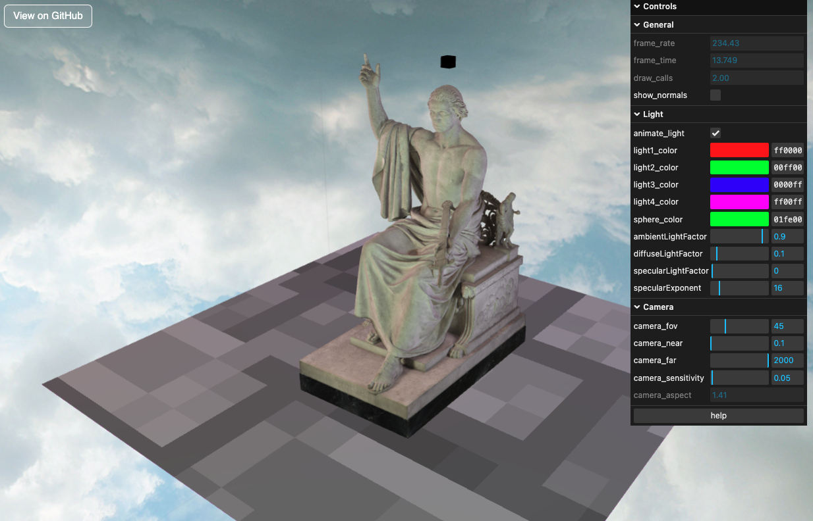

# 💎 VoxelMiner
VoxelMiner is an interactive 3D graphics engine developed using WebGL, originally created as a project for CSE 160 at UCSC, and later enhanced with additional features. It enables users to explore and interact with a voxel-based 3D environment, complete with real-time lighting, textures, camera movement, and advanced rendering techniques. SceneGraph, Renderer, Camera are the main components which are modular with their responsibilities. The engine is designed to be extensible, allowing for future enhancements and features.
Example of a basic scene is in game/ where index.html + script.js utilize the game/ and lib/ to make a basic animation. VoxelMiner namespace holds the methods to use the engine.

- [🔗 Basic Game](https://ashwanirathee.com/VoxelMiner/example/basic)
- [🔗 Statue of George Washington(Smithsonian) with 400k vertex count](https://ashwanirathee.com/VoxelMiner/example/scan) displayed via VoxelMiner

#### Example:

### 🚀 Key Features
#### Core Modules
    - SceneGraph: Manages the 3D scene, including objects and their properties
    - Renderer: Handles rendering of the scene with WebGL
    - Camera: Provides camera controls and perspective management

#### 🎮 Camera & Navigation
- Movement Controls:
    - W – Move Forward
    - S – Move Backward
    - A – Move Left
    - D – Move Right
    - Q – Pan Left
    - E – Pan Right
    - R – Move Up
    - F – Move Down
    
- Customizable View:
    - Adjustable Field of View (FOV)
    - Configurable Near & Far Clipping Planes
    - Adjustable camera speed(T,G), pan speed(Y,H)

#### 💡 Lighting System
- Phong Lighting Model
    - Includes Ambient, Diffuse, and Specular components
    - Adjustable shininess factor (default: 5.0)

- Spotlight with Smooth Falloff
    - Soft edges using angular cutoff and smoothing via smoothstep()

- Point Lights with support for atmost 4 lights
    - Adjustable position, light color and intensity

### 🌟 Rendering & Visual Effects
- Basic multi-pass rendering supported now, more to come. Designed to support more shaders that are used in rendering. 

- Normal Mapping
    - Toggle enhanced surface detail via normal maps
- Normal Visualization
    - Debug mode to visualize surface normals directly

- Skybox Rendering
    - Immersive skybox to simulate environment background
    - Multiple options available for skybox textures: 
        - HydroPlanet
        - Clouds(Blue, Gray, Brown, Yellow)

- Crosshair
    - Centered crosshair for better navigation

### ⛏️ Interaction & World Mechanics
- Block Mechanics:
    - Add and break blocks in the world(currently unsupported in game/)

- Collision Detection:
    - Prevents camera from passing through solid objects(currently unsupported in game/)

- Canvas Resizing with high DPI support:
    - Automatically adjusts canvas size for high-DPI displays
    - Maintains aspect ratio and resolution

- Animation support
    - Basic animation support for objects in the scene

### 🧱 Primitives & Texturing
- Available 3D Primitives:
    - Cube, Sphere, Cylinder, Triangle, Point, Circle

- Texture Mapping:
    - Multiple textures with mipmapping for performance and clarity

### ⚙️ Performance & Optimization
- Instanced Rendering(currently not supported):
    - Efficient rendering of large numbers of cubes using instancing

- Real-Time Stats:
    - Frame rate (FPS) monitor
    - Frame render time display
    - Draw calls(currently only scene graph shapes)

- Added support for fine-grained debugging
    - Toggle debug mode for detailed information in specific files
    - Debugging information is displayed in the console and some data can be global debug log

- Focus on single responsibility principle for each module
    - Each module is designed to handle a specific aspect of the engine, promoting modularity and maintainability
